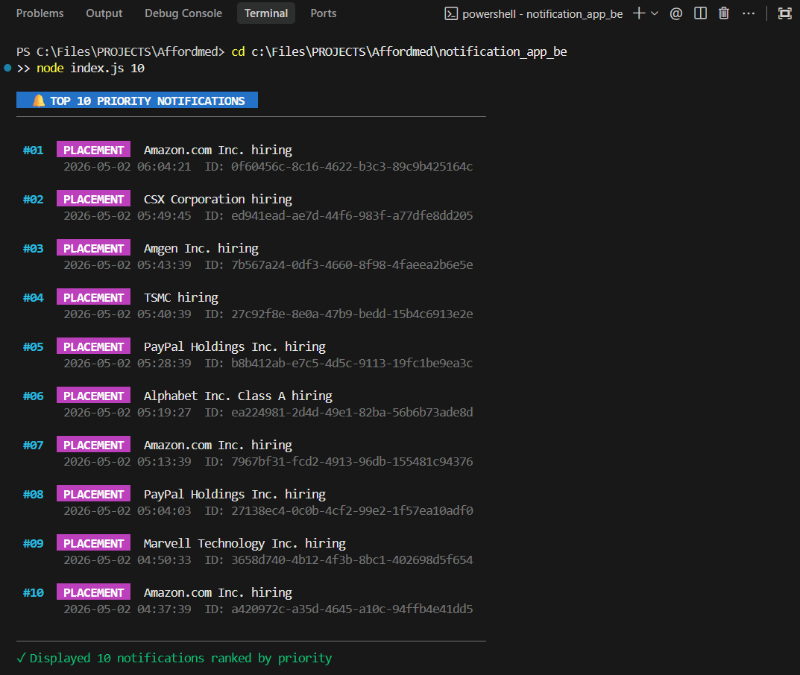
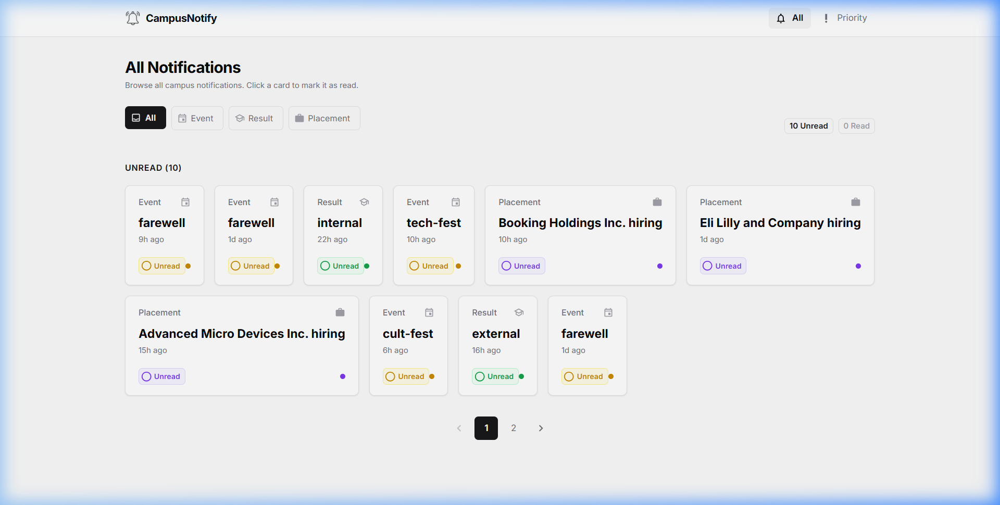
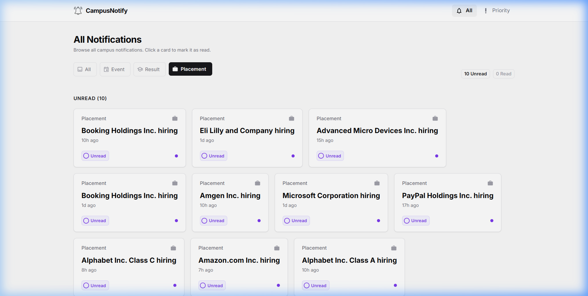
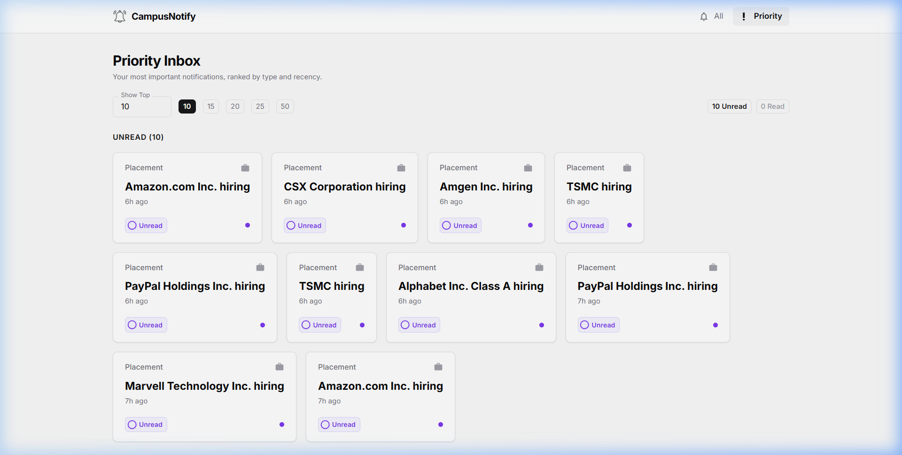
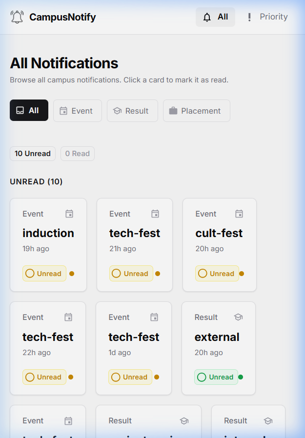
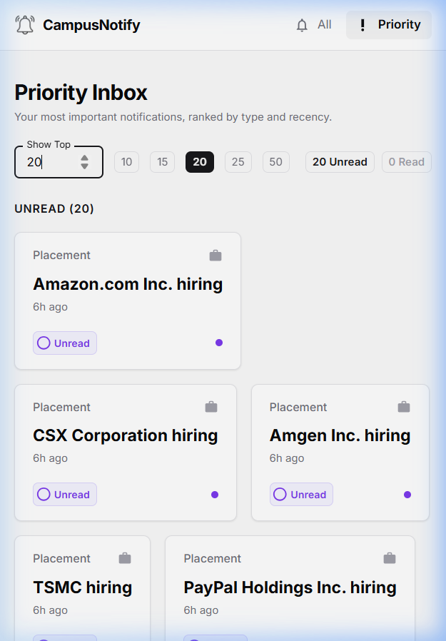

# Campus Notifications

A full-stack campus notification system with a priority inbox algorithm and a React + Material UI frontend.

- **Stage 1**: Backend CLI that ranks notifications using a Min-Heap
- **Stage 2**: React dashboard for browsing, filtering, and tracking read/unread status

## Project Structure

```
├── logging_middleware/            Reusable logging module (no dependencies)
├── notification_app_be/           Backend — Priority Inbox CLI (Stage 1)
├── notification_app_fe/           React + MUI Frontend (Stage 2)
├── screenshots/                   App screenshots
├── notification_system_design.md  Algorithm design document
└── README.md
```

## Quick Start

### 1. Install Logging Middleware

```bash
cd logging_middleware
npm install
```

### 2. Run Backend (Stage 1)

```bash
cd notification_app_be
npm install
node index.js        # default top 10
node index.js 20     # custom top N
```

### 3. Run Frontend (Stage 2)

```bash
cd notification_app_fe
npm install
npm run dev
```

Open [http://localhost:3000](http://localhost:3000) in your browser.

## Screenshots

### Stage 1 — CLI Output



### All Notifications (Desktop)



### Placement Filter



### Priority Inbox (Desktop)



### Mobile Views

| All Notifications | Priority Inbox |
|---|---|
|  |  |

## Features

- **Priority Inbox**: Ranks notifications by type weight (Placement > Result > Event) and recency using a Min-Heap with O(N log K) time complexity
- **All Notifications**: Browse with type-based filtering (All / Event / Result / Placement), pagination, and persistent read/unread tracking
- **Priority Inbox Page**: View top N most important notifications with a configurable input and quick-pick presets
- **Read/Unread Tracking**: Click any card to mark as read — persisted in localStorage across sessions
- **Retry Logic**: Handles transient API errors (502/503/504) with exponential backoff
- **Custom Logging**: All operations logged via a dedicated middleware that sends structured logs to the evaluation service

## Tech Stack

- **Frontend**: React (Vite) + Material UI
- **Backend**: Node.js (ES Modules)
- **Logging**: Custom middleware — zero dependencies
- **API**: Live data from the evaluation service (no database)

## Algorithm

The priority ranking uses a fixed-capacity Min-Heap:

```
score = type_weight × 10¹³ + unix_timestamp_ms
```

| Type | Weight |
|---|---|
| Placement | 3 |
| Result | 2 |
| Event | 1 |

See [notification_system_design.md](notification_system_design.md) for the full design document with complexity analysis.
